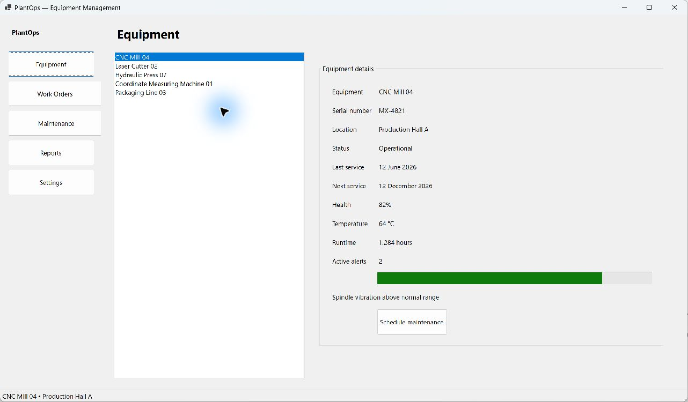
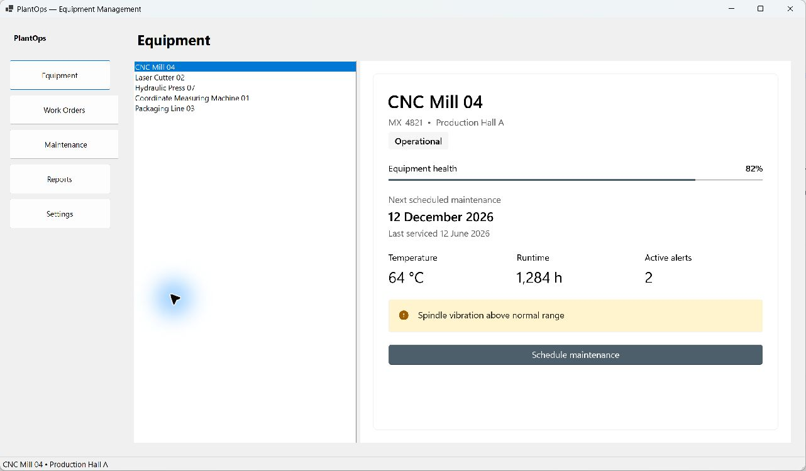

# PlantOps — incremental WinForms modernization

PlantOps is a deliberately small example showing how an existing .NET Windows Forms application can introduce WinUI 3 incrementally rather than being completely rewritten. It assumes the application already runs on modern .NET; runtime migration is outside this example.

Open either solution independently. Select **CNC Mill 04**, then choose **Schedule maintenance**. Both versions open the same WinForms maintenance dialog. Only the equipment details area changes.

| Before | After |
| --- | --- |
|  |  |

```text
Before/
  PlantOps.Before.sln
  PlantOps/              WinForms application and equipment details
  PlantOps.Core/         Equipment, repository and event arguments
After/
  PlantOps.After.sln
  PlantOps/              Same WinForms application, plus island hosting
  PlantOps.Core/         Independent copy of the same domain code
  PlantOps.WinUI/        Compiled XAML equipment status UserControl
```

## Prerequisites

- Windows 11, x64. The application minimum is Windows build **22000**.
- .NET SDK **10.0.400** or a later patch in that feature band. `global.json` uses `latestPatch`; final validation used **10.0.401**.
- Visual Studio 2026 with **.NET desktop development**, WinUI development tooling and Windows SDK **10.0.26100.0**. Use a current serviced Visual Studio that supports the installed .NET SDK; final validation used VS **18.10.12201.205**. CLI builds work with the installed SDK/tooling too.
- NuGet access for the initial restore.

Both UI projects target `net10.0-windows10.0.26100.0`; the Core projects target `net10.0`. After pins **Microsoft.WindowsAppSDK 2.4.0**, the stable package selected on 10 September 2026. Its resolved WinUI package is **2.3.6**, and SDK BuildTools is **10.0.26100.4654**. Each `packages.lock.json` records the full dependency graph.

## Run Before

Open `Before/PlantOps.Before.sln`, set **PlantOps** as the startup project, choose **Debug / x64**, and press F5.

Or, from the repository root in PowerShell:

```powershell
dotnet build Before/PlantOps.Before.sln -c Debug -p:Platform=x64
& .\Before\PlantOps\bin\x64\Debug\net10.0-windows10.0.26100.0\PlantOps.exe
```

## Run After

Open `After/PlantOps.After.sln`, set **PlantOps** as the startup project (not PlantOps.WinUI), choose **Debug / x64**, and press F5. Use the **Project** launch target if Visual Studio offers launch profiles.

```powershell
dotnet build After/PlantOps.After.sln -c Debug -p:Platform=x64
& .\After\PlantOps\bin\x64\Debug\net10.0-windows10.0.26100.0\win-x64\PlantOps.exe
```

Close a running copy before rebuilding its output directory. After is unpackaged and carries the Windows App SDK runtime beside the executable; there is no separate MSIX installation or Windows App Runtime bootstrap installer for this demo. Normal builds still require the **.NET 10 Desktop Runtime**, supplied by the development prerequisites.

To produce a folder that also carries .NET:

```powershell
dotnet publish After/PlantOps/PlantOps.csproj -c Release -p:Platform=x64 -r win-x64 --self-contained true -p:PublishTrimmed=false -o artifacts/After
```

Distribute the **entire output folder**, including native DLLs, PRI files, and the `PlantOps.WinUI` resource directory. This repository does not provide an installer or single-file publishing configuration. Validate deployment on a clean target machine before distribution.

## What changes

Navigation, equipment selection, `MainForm`, the domain objects, status bar and `ScheduleMaintenanceForm` remain WinForms/existing C#. The two Core copies and maintenance forms are intentionally identical and neither solution references the other directory.

1. Keep the existing `MaintenanceRequested` event and `RequestMaintenance(Equipment)` handler.
2. Add a WinUI class library containing `EquipmentStatusPanel`.
3. Initialize the Windows App SDK, dispatcher and XAML environment on the existing STA thread.
4. Host the panel beneath a WinForms control HWND and resize it with that control.
5. Pass the selected `Equipment` into the panel and route its maintenance event back to the existing handler.

WinForms layouts are built in C# constructors deliberately. There are no designer-backed forms to edit visually; inspect the constructors to follow the layout. WinUI uses compiled XAML with generated metadata.

## Source guide

- [Before equipment details](Before/PlantOps/EquipmentDetailsControl.cs)
- [After equipment XAML](After/PlantOps.WinUI/EquipmentStatusPanel.xaml) and [data/event code](After/PlantOps.WinUI/EquipmentStatusPanel.xaml.cs)
- [WinForms island host](After/PlantOps/WinUIHostControl.cs): HWND creation, sizing, focus, recreation and disposal
- [Startup](After/PlantOps/Program.cs), [XAML metadata/resources](After/PlantOps/XamlEnvironment.cs), and [message translation](After/PlantOps/XamlMessageFilter.cs)
- [Existing application handler](After/PlantOps/MainForm.cs) and [maintenance dialog](After/PlantOps/ScheduleMaintenanceForm.cs)
- [Architecture and official references](docs/architecture.md)

## Verification

```powershell
.\build\Verify.ps1
```

This restores with locked dependencies and builds each solution separately in Release/x64. Add `-RunHostChecks` on an interactive Windows desktop to exercise the real After island, all selections, owned dialogs/cancellation, focus restoration, resizing, HWND recreation and disposal. The check opens and closes test windows; its report is written to `artifacts/host-verification.txt`.

See [validation results and manual checklist](docs/validation.md) for what was actually tested.

## Known limitations

Five fixed sample machines, no persistence or live telemetry. Scheduling shows a confirmation and changes the status message; it does not change service dates. Other navigation destinations are placeholders. Light theme, Windows 11 and x64 are the intended scope. The minimum window size assumes adequate desktop space at the chosen scaling. Mixed-monitor DPI transitions, additional scaling settings, screen-reader testing and a clean-machine deployment remain manual validation items.
