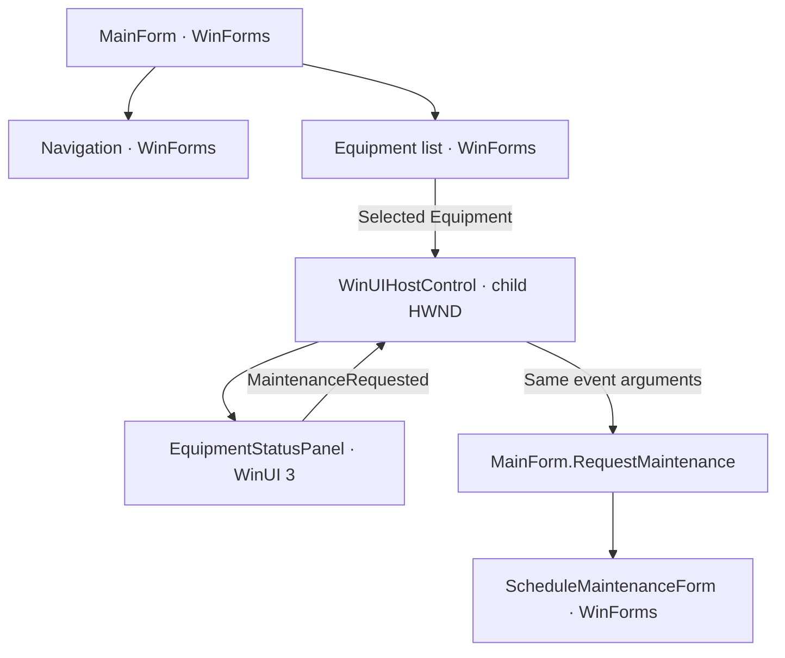

# Architecture

PlantOps retains one WinForms process, one STA UI thread, one top-level WinForms window, and the WinForms message loop. The WinUI `Application` supplies XAML services; it does not open a WinUI window or start a second application loop.



## The comparison to read

`Before/PlantOps/MainForm.cs` owns an `EquipmentDetailsControl`; After owns a `WinUIHostControl`. Both use the same selection handler and maintenance handler:

```csharp
private void RequestMaintenance(Equipment equipment)
{
    using var dialog = new ScheduleMaintenanceForm(equipment);
    if (dialog.ShowDialog(this) == DialogResult.OK)
        _status.Text = $"Maintenance scheduled for {equipment.Name}";
}
```

Core stores immutable sample equipment objects. The host retains the currently selected object when its HWND is not yet available, and supplies that object to the newly created panel. There is no duplicated WinUI view model or separate application state. After has its own identical Core project to keep the two solutions independent.

## Startup and resources

1. The executable's Windows App SDK targets generate automatic registration-free WinRT initialization. `WindowsPackageType=None` and `WindowsAppSDKSelfContained=true` select app-local runtime deployment. The latter belongs on the executable only, not on the class library.
2. `ApplicationConfiguration.Initialize` configures WinForms and PerMonitorV2 DPI awareness before creating application HWNDs.
3. The `[STAThread]` entry point creates `DispatcherQueueController` on that same thread.
4. `XamlEnvironment`, a `Microsoft.UI.Xaml.Application` implementing `IXamlMetadataProvider`, registers the standard controls metadata provider and the generated `PlantOps.WinUI` provider.
5. `WindowsXamlManager.InitializeForCurrentThread` initializes XAML. Only then does `InitializeResources` set the light theme and merge `XamlControlsResources`. Setting Application properties before the XAML manager initialized caused a runtime failure during development.
6. A WinForms message filter forwards native messages to `ContentPreTranslateMessage`, then the normal WinForms `Application.Run` begins. The same filter remains active during owned modal dialogs.

The class library sets `XamlResourceMapName=PlantOps.WinUI`. This gives the generated `LoadComponent` URI a stable library resource-map identity. The build emits XBF/PRI resources and copies/merges them into the app output. Omitting this setting produced a root-relative resource lookup and `XamlParseException` in this configuration. Keep the generated library PRI and resource directory with the executable.

`ImportFrameworkWinFXTargets=true` on the host follows Microsoft's WinForms Islands sample, preventing Windows Desktop SDK imports from interpreting WinUI resources as WPF XAML. `app.manifest` declares modern Windows compatibility and `maxversiontested` under the compatibility application's element.

The executable's `PublishIslandResources` target adds its merged PRI and the library's XAML/XBF directory to `ResolvedFileToPublish`. The WinForms publish pipeline otherwise omitted these resources even though normal build output was runnable. After's shared build properties specify `win-x64` so a publish does not change Core's runtime identifier relative to its locked solution restore.

## Native containment and resizing

`WinUIHostControl.OnHandleCreated` creates `DesktopWindowXamlSource`, calls `Initialize(Win32Interop.GetWindowIdFromWindow(Handle))`, and assigns the WinUI control to `Content`. The resulting child HWND belongs to the WinForms host HWND. This uses public **Microsoft.UI.Xaml** APIs, not the older UWP `Windows.UI.Xaml`/`IDesktopWindowXamlSourceNative` approach.

`SiteBridge.MoveAndResize` receives `(0, 0, ClientSize.Width, ClientSize.Height)` whenever the host resizes or receives its post-parent DPI notification. These are physical pixels. WinUI handles conversion to device-independent layout units; multiplying by DPI again would double-scale the island. The WinForms containers declare their authored 96-DPI baseline. The WinUI panel wraps text and scrolls vertically when needed, with an opaque theme background to avoid stale parent painting on resize.

## Events and focus

The WinUI Button raises a plain C# event containing the selected `Equipment`. The host queues delivery with `BeginInvoke`, allowing the WinUI Click call stack to unwind before the existing handler enters a nested WinForms modal message loop. No WinUI object crosses threads.

`OnGotFocus` calls `NavigateFocus(First/Last)` to enter the island. `TakeFocusRequested` returns forward/reverse Tab navigation to the owning form's tab order using `SelectNextControl`. After the modal handler returns, the host restores focus to the WinUI maintenance button. The event arguments retain the clicked machine even if a later selection is different.

The message filter P/Invoke uses the native MSG layout, including pointer-sized HWND/WPARAM/LPARAM fields and BOOL return marshaling. It is intentionally kept in a small separate file because WinUI does not supply a managed projection for this function.

## Lifetime and shutdown

The host unsubscribes panel and focus events, clears Content, and disposes the source before its HWND is destroyed. `Dispose` also calls the same idempotent release method. An HWND recreation creates a new source and visual tree and reapplies the retained Equipment; old event subscriptions are removed. Deferred maintenance callbacks check whether the host has been disposed.

The MainForm removes its subscriptions on disposal. Its owned maintenance dialog uses `using`. After the WinForms loop exits, the form/island is disposed, the message filter is removed, the XAML manager is disposed, and `DispatcherQueueController.ShutdownQueue()` drains the queue synchronously. The XAML Application is kept alive through shutdown. There is no blocking wait on `ShutdownQueueAsync` on the UI thread.

`HostVerification.cs` is an opt-in integration check, isolated from the normal application flow. It uses the actual XAML button automation peer and real WinForms dialogs, checks native parenting and dimensions, forces HWND recreation, and verifies state/subscriptions/focus/disposal. Reflection there inspects private test state; it is not part of the hosting architecture.

## Deployment and supported baseline

The selected stable metapackage is Windows App SDK **2.4.0**, verified against Microsoft's downloads/release notes on 10 September 2026. The managed target is .NET 10; Microsoft documents managed XAML Islands and supplies a WinForms sample (targeting .NET 8). This repository's .NET 10 combination is backed by the local build/runtime checks in `validation.md`, rather than treating the sample's target framework as a .NET 10 certification claim.

The application deliberately targets Windows 11 (minimum 22000, target SDK 26100), despite the Windows App SDK supporting older Windows versions. Use a current supported Visual Studio 2026 and .NET 10 SDK. The README records exact local versions and commands.

App-local Windows App SDK deployment avoids a runtime installer/bootstrap package dependency for this UI-only demo. Ordinary builds rely on installed .NET Desktop Runtime; the documented self-contained publish command also carries .NET. Ship the whole publish folder and service its bundled dependencies with application updates. Notifications, identity-dependent APIs, installers and Store distribution are outside the example.

## Official references

- [Host WinUI controls with XAML Islands](https://learn.microsoft.com/en-us/windows/apps/desktop/modernize/host-controls-existing-desktop-apps)
- [Microsoft's WinForms Islands sample](https://github.com/microsoft/WindowsAppSDK-Samples/tree/main/Samples/Islands/cs-winforms-unpackaged)
- [DesktopWindowXamlSource.Initialize](https://learn.microsoft.com/en-us/windows/windows-app-sdk/api/winrt/microsoft.ui.xaml.hosting.desktopwindowxamlsource.initialize)
- [Windows App SDK downloads](https://learn.microsoft.com/en-us/windows/apps/windows-app-sdk/downloads) and [2.0 release line notes, including 2.4.0](https://learn.microsoft.com/en-us/windows/apps/windows-app-sdk/release-notes/windows-app-sdk-2-0)
- [Self-contained deployment and registration-free initialization](https://learn.microsoft.com/en-us/windows/apps/package-and-deploy/self-contained-deploy/deploy-self-contained-apps)
- [.NET SDK and Visual Studio compatibility](https://learn.microsoft.com/en-us/dotnet/core/porting/versioning-sdk-msbuild-vs)
